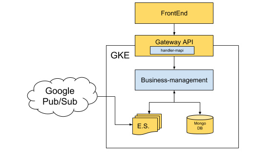
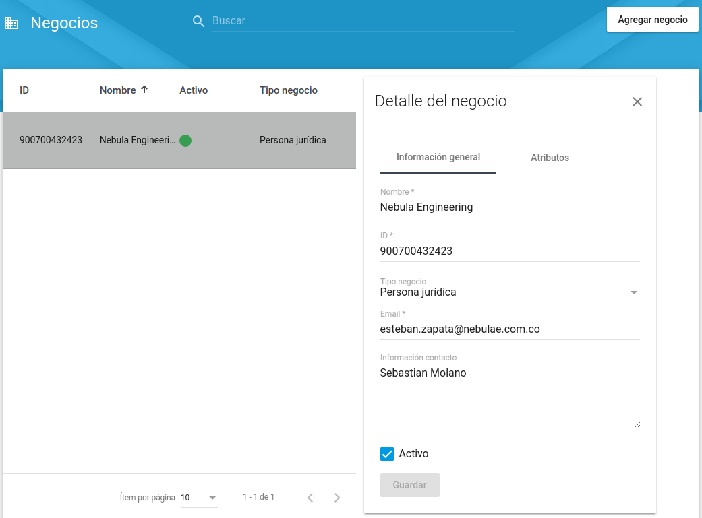
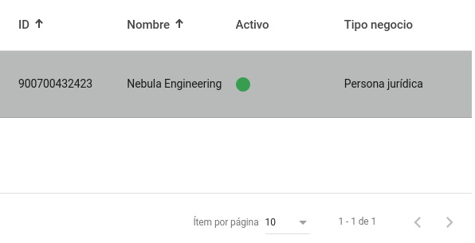
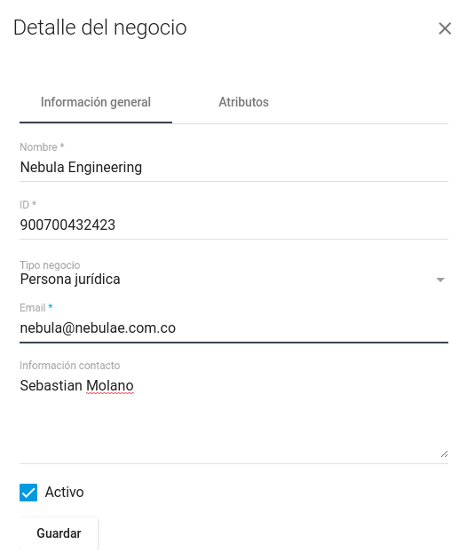
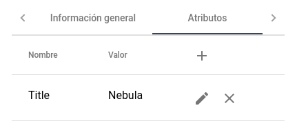
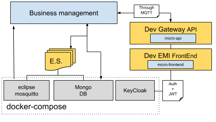

# BusinessManagement

The general purpose of this service is manage (Create, update and query) the businesses registered on the platform.

_This MicroService is built on top of NebulaE MicroService Framework.  Please see the [FrameWork project](https://github.com/NebulaEngineering/nebulae) to understand the full concept_**.


# Table of Contents
  * [Project Structure](#structure)
  * [FrontEnd](#frontend)
    *  [Environment variables](#frontend_env_vars)
  * [API](#api)
    * [GraphQL throught gateway API](#api_gateway_graphql)
  * [BackEnd](#backend)
    *  [business-management](#backend_business-management)
        * [Environment variables](#backend_business-management_env_vars)
        * [Event Sourcing](#backend_business-management_eventsourcing)
        * [CronJobs](#backend_business-management_cronjobs)
  * [Development environment](#dev_env)
# Project structure <a name="structure"></a>

```
├── frontend                            => Micro-FrontEnd  
│   └── emi                             => Micro-FrontEnd for [emi FrontEnd](https://github.com/nebulae-tpm/emi)
├── api                                 => Micro-APIs  
│   └── emi-gateway                         => Micro-API for [emi-gateway API](https://github.com/nebulae-tpm/emi-gateway)  
├── backend                             => Micro-BackEnds  
│   ├── business-management             => Micro-BackEnd responsible for ...
├── etc                                 => Micro-Service config Files.  
├── deployment                          => Automatic deployment strategies  
│   ├── compose                         => Docker-Compose environment for local development  
│   └── gke                             => Google Kubernetes Engine deployment file descriptors  
│   └── mapi-setup.json                 => Micro-API setup file  
├── .circleci                           => CircleCI v2. config directory
│   ├── config.yml
│   └── scripts
├── docs                                => Documentation resources  
│   └── images  
├── README.md                           => This doc
```
# Frontend <a name="frontend"></a>

In this section you can manage (Create, update, query) all the businesses that are registered on the platform and display them on the page. A business cannot be deleted, only can be deactivated.



## Filter

This section has a filter in which you can perform businesses searches by its ID or name.


## Business list

All the registered businesses  will be shown on the view's table.



## Form

If you click over a business on the table component, the information of the business will be shown on the left panel. There you can create, edit, activate or deactivate a business. Once you change the data just click over the Save Button.



If you want to update the attributes of a business, go to the attributes tab and edit the information on the table. On this tab, the information will be updated without needing to press save button.



# API <a name="api"></a>
Exposed interfaces to send Commands and Queries by the CQRS principles.
The MicroService exposes its interfaces as Micro-APIs that are nested on the general API.

## GraphQL throught gateway API <a name="api_gateway_graphql"></a>
These are the exposed GraphQL functions throught the [emi-gateway API](https://github.com/nebulae-tpm/emi-gateway).  

Note: You may find the GraphQL schema [here](api/emi-gateway/graphql/business-management/schema.gql)

### GraphQL Enums

* BusinessType: There are two types of businesses (LEGAL and NATURAL).

### GraphQL types and Inputs
* Business: this type represents the businesses

      type Business {
        _id: ID
        generalInfo: GeneralInfo
        attributes: [BusinessAttributes],
        state: Boolean
      }

* GeneralInfo: Contains the general info of the business (Name, type, email, contactInfo, ...).

      type GeneralInfo {
        businessId: String!,
        name: String!,
        type: BusinessType,
        email: String,
        contactInfo: String
      }

* BusinessAttributes: Contains the attributes of the business.

      type BusinessAttributes {
        key: String
        value: String
      }

* CommandResponse: this is the response of the mutations.

      type CommandResponse{
          code: Int
          message: String
      }

* BusinessPersistInput: This input is used to create a new business

      input BusinessPersistInput {
        generalInfo: BusinessGeneralInfoInput
        attributes: [BusinessAttributeInput],
        state: Boolean!
      }

* BusinessGeneralInfoInput: This input is used to update the general info of a business

      input BusinessGeneralInfoInput {
        businessId: String!
        name: String!
        type: BusinessType!
        email: String
        contactInfo: String
      }

* BusinessAttributeListInput: This input is used to update the attributes of a business

      input BusinessAttributeListInput {
        attributes: [BusinessAttributeInput],
      }

      input BusinessAttributeInput {
        key: String,
        value: String
      }
    
### GraphQL Queries

#### getBusiness(id: String!): Business

* Description: Gets the business filtered by the id.
* Params: 
    * id:  Id of the business
* returns: Business object

#### getBusinesses(page: Int!, count: Int!, filter: String, sortColumn: String, sortOrder: String): [Business]

* Description: Gets the businesses according to the passed filters.
* Params: 
    * page: Page 
    * count: Amount of business to return.
    * filter: Text filter with which the businesses will be filtered.
    * sortColumn: Column that will be used to filter the businesses.
    * sortOrder: Indicates the order (asc, desc) with which the info will be sorted.
* returns: Business object array

#### getBusinessCount: Int

* Description: Gets the amount of registered businesses 
* returns: Int

### GraphQL Subscriptions

#### BusinessUpdatedSubscription

* Description: Event fired when a business is created or updated
* returns: Business object

### GraphQL Mutations
  
#### persistBusiness(input: BusinessPersistInput): CommandResponse

* Description: Creates a new business.
* Params: 
  * BusinessPersistInput
* returns: CommandResponse

#### updateBusinessGeneralInfo(id:ID, input: BusinessGeneralInfoInput): CommandResponse

* Description: Updates the business general info
* Params: 
  * id: business id
  * BusinessGeneralInfoInput
* returns: CommandResponse

#### updateBusinessAttributes(id:ID, input: BusinessAttributeListInput): CommandResponse

* Description: Updates the business attributes
* Params: 
  * id: business id
  * BusinessAttributeListInput
* returns: CommandResponse

#### updateBusinessAttributes(id:ID, input: BusinessAttributeListInput): CommandResponse

* Description: Updates the business state
* Params: 
  * id: business id
  * state: Boolean
* returns: CommandResponse

# BackEnd <a name="backend"></a>
Backends are defined processes within a docker container.  
Each process is responsible to build, run and maintain itself.  

Each BackEnd has the following running commands:
  * npm start: executes main program
  * npm run get-ready: execute maintenance routines such DB indexes creation
  * npm run sync-state:  syncs backend state by reading all missing Events from the event-store
  * npm test: runs unit tests

## business-management <a name="backend_business-management"></a>

### Environment variables <a name="backend_business-management_env_vars"></a>


```
+------------------------------------------+--------+----------------------------------------------------------------------------------------------+-------+-----------+
|                 VARIABLE                 | TYPE   |                                          DESCRIPTION                                         |  DEF. | MANDATORY |
|                                          |        |                                                                                              | VALUE |           |
+------------------------------------------+--------+----------------------------------------------------------------------------------------------+-------+-----------+
| production                               | bool   | Production enviroment flag                                                                   | false |           |
+------------------------------------------+--------+----------------------------------------------------------------------------------------------+-------+-----------+
| EVENT_STORE_BROKER_TYPE                  | enum   | Event store broker type to use.                                                              |       |     X     |
|                                          | string | Ops: PUBSUB, MQTT                                                                            |       |           |
+------------------------------------------+--------+----------------------------------------------------------------------------------------------+-------+-----------+
| EVENT_STORE_BROKER_EVENTS_TOPIC          | enum   | Event store topic's name.                                                                    |       |     X     |
|                                          | string |                                                                                              |       |           |
+------------------------------------------+--------+----------------------------------------------------------------------------------------------+-------+-----------+
| EVENT_STORE_STORE_TYPE                   | enum   | Event store storage type to use.                                                             |       |     X     |
|                                          | string | Ops: MONGO                                                                                   |       |           |
+------------------------------------------+--------+----------------------------------------------------------------------------------------------+-------+-----------+
| EVENT_STORE_STORE_URL                    | string | Event store storage URL or connection string.                                                |       |     X     |
|                                          |        | Eg.: mongodb://127.0.0.1:27017/test                                                          |       |           |
+------------------------------------------+--------+----------------------------------------------------------------------------------------------+-------+-----------+
| EVENT_STORE_STORE_AGGREGATES_DB_NAME     | string | Event store storage database name for Aggregates                                             |       |     X     |
|                                          |        | Eg.: Aggregates                                                                              |       |           |
+------------------------------------------+--------+----------------------------------------------------------------------------------------------+-------+-----------+
| EVENT_STORE_STORE_EVENTSTORE_DB_NAME     | string | Event store storage database name prefix for Event Sourcing Events                           |       |     X     |
|                                          |        | Eg.: EventStore                                                                              |       |           |
+------------------------------------------+--------+----------------------------------------------------------------------------------------------+-------+-----------+
| GOOGLE_APPLICATION_CREDENTIALS           | string | Production only.                                                                             |       |     X     |
|                                          |        | Google service account key path to access google cloud resources.                            |       |           |
|                                          |        |                                                                                              |       |           |
|                                          |        | Eg.: /etc/GOOGLE_APPLICATION_CREDENTIALS/gcloud-service-key.json                             |       |           |
+------------------------------------------+--------+----------------------------------------------------------------------------------------------+-------+-----------+
| LOCKVERSION                              | string | Production only.                                                                             |       |     X     |
|                                          |        | word or phrase used to evaluate if the sync task should be run before starting this backend. |       |           |
|                                          |        | This value must be changed to force state sync task.                                         |       |           |
+------------------------------------------+--------+----------------------------------------------------------------------------------------------+-------+-----------+
| MONGODB_URL                              | string | Materialized views MONGO DB URL                                                              |       |     X     |
|                                          |        | Eg.: mongodb://127.0.0.1:27017/test                                                          |       |           |
+------------------------------------------+--------+----------------------------------------------------------------------------------------------+-------+-----------+
| MONGODB_DB_NAME                          | string | Materialized views MONGO DB name                                                             |       |     X     |
|                                          |        | Eg.: business-management                                                                     |       |           |
+------------------------------------------+--------+----------------------------------------------------------------------------------------------+-------+-----------+
| JWT_PUBLIC_KEY                           | string | RSA Public key to verify JWT Tokens.                                                         |       |     X     |
|                                          |        | Format: -----BEGIN PUBLIC KEY-----\nPUBLIC_KEY\n-----END PUBLIC KEY-----                     |       |           |
+------------------------------------------+--------+----------------------------------------------------------------------------------------------+-------+-----------+
| REPLY_TIMEOUT                            | number | TimeOut in milliseconds in case of sending data through the broker and waiting the response. |  2000 |           |
+------------------------------------------+--------+----------------------------------------------------------------------------------------------+-------+-----------+
| BROKER_TYPE                              | enum   | Broker type to use for inter-process communication.                                          |       |     X     |
|                                          | string | Ops: PUBSUB, MQTT                                                                            |       |           |
+------------------------------------------+--------+----------------------------------------------------------------------------------------------+-------+-----------+
```
#### Notes: 
  * ENV VARS for development are [here](backend/business-management/.env)
  * ENV VARS for production are [here](deployment/gke/deployment-business-management.yaml)

### Event Sourcing <a name="backend_business-management_eventsourcing"></a>
    Event sourcing events this Micro-BackEnd is subscribed to or is publishing.

#### Subscribed events:    
* BusinessCreated: Business had been created.
* BusinessGeneralInfoUpdated: Business general info had been updated.
* BusinessAttributesUpdated: Business attributes had been updated.
* BusinessActivated: Business has been activated.
* BusinessDeactivated: Business has been deactivated.


#### Published events: 
* BusinessCreated: Business had been created.
* BusinessGeneralInfoUpdated: Business general info had been updated.
* BusinessAttributesUpdated: Business attributes had been updated.
* BusinessActivated: Business has been activated.
* BusinessDeactivated: Business has been deactivated.

### CronJobs <a name="backend_business-management_cronjobs"></a>
Time-based jobs that are configured and triggered by the [CronJob MicroService](https://github.com/nebulae-tpm/ms-cronjob)

N/A

# Development environment <a name="dev_env"></a>


## Install requeriments
* [node](https://nodejs.org/en/)
* [docker](https://docs.docker.com/install/)
* [docker-compose](https://docs.docker.com/compose/install/)
* [nodemon](https://www.npmjs.com/package/nodemon) 
   ```npm install -g nodemon```
* [Nebulae CLI](https://www.npmjs.com/package/@nebulae/cli)  
  ```npm install -g @nebulae/cli```  

## Prepare environment


### 1. clone this repo  
   ```git clone https://github.com/nebulae-tpm/ms-business-management.git```  
   

### 2. start databases, broker and security systems using docker-compose
```
cd deployment/compose/
docker-compose up
```

### 3. setup keycloak

#### LogIn to KeyCloak Admin Console
*  Navigate to http://localhost:8080/auth/admin/
*  user: keycloak
*  pass: keycloak  
    
#### Import Development realm: 
*  click on 'add realm' on the left panel
*  Select import option
*  import the file located at docs/resources/keycloakRealmToImport.json
  
#### Create the initial user:
* select the DEV_TPM keycloak realm and click on the users option from the left panel.
* select 'add user' option , fill the needed fields and enable the 'Email Verified' option.
* set a password by editing the user, open the 'credentials' tabs, type a new password and deselect the 'Temporary' option


Add the **PLATFORM-ADMIN**, **developer** and **operator** rol to your user:
* select user option in the left panel and click on your user id.
* select the 'role mapping' tab
* select **PLATFORM-ADMIN**, **developer** and **operator** options from available roles and click on add selected

### 4. Create PlayGround folder
   PlayGround is a directory where we are going to place the FrontEnd and API shells so the developer can run tests
   ```
   cd  REPO_DIRECTORY
   mkdir playground   
   ```

### 5. Compose FrontEnd
```
nebulae compose-ui development --shell-type=FUSE2_ANGULAR --shell-repo=https://github.com/nebulae-tpm/emi --frontend-id=emi --output-dir=/FULL_PATH_TO_REPO/ms-business-management/playground/emi  --setup-file=/FULL_PATH_TO_REPO/ms-business-management/etc/mfe-setup.json
```

### 6. Compose the API emi-gateway
```
nebulae compose-api development --api-type=NEBULAE_GATEWAY --api-repo=https://github.com/nebulae-tpm/emi-gateway --api-id=emi-gateway --output-dir=FULL_PATH_TO_REPO/ms-business-management/playground/emi-gateway  --setup-file=FULL_PATH_TO_REPO/ms-business-management/etc/mapi-setup.json
```

### 7. Set the JWT token 
* LogIn to keycloak http://localhost:8080/auth/admin/ (user: "keycloak", pass: "keycloak")
* select the DEV_TPM keycloak realm and click on 'realm settings' in left panel
* select keys option tab
* click on 'public key' from the RSA key and copy the contents.
* set this key value to the **JWT_PUBLIC_KEY** atribute in the following files: *WORKING_FOLDER*/ms-business-management/backend/business-management/.env   *WORKING_FOLDER*/ms-business-management/playground/emi-gateway/.env  
Note: use the following format: ```JWT_PUBLIC_KEY=-----BEGIN PUBLIC KEY-----\nPUT_HERE_JWT_PUBLIC_KEY_VALUE\n-----END PUBLIC KEY-----```
* Setup the Apollo engine key to trace API requests
    * create a key at https://engine.apollographql.com/ and set it to the **APOLLO_ENGINE_API_KEY** atribute in the playground/emi-gateway/.env file

### 8. Remove FrontEnd base href used on production
change ```<base href="/emi/">``` to ```<base href="/">``` in the index.html located at playground/emi/src/index.html


## Start the development environment
1. Start the persistence layer, the broker and keycloak
```
cd deployment/compose/
docker-compose up
```
1. Start the Micro-BackEnd
```
cd backend/business-management/
npm install
npm start
```
3. Start the API emi-gateway
```
cd playground/emi-gateway
npm run start-dev-env
```
4. Start the FrontEnd
```
cd playground/emi
npm run start-dev-env
```

Finally navigate to http://localhost:4200/